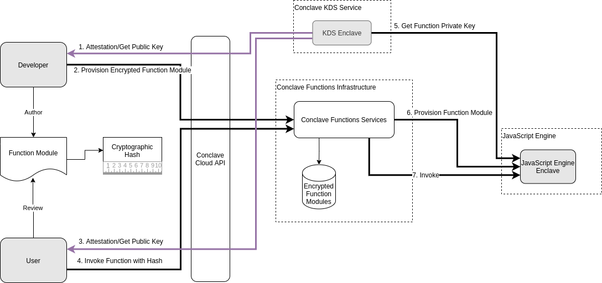

# Conclave Auction using Conclave Cloud

This is a sample use case for R3's Conclave Confidential Computing Platform. 
It allows bidders to confidentially submit their bids to an enclave 
(A protected region of memory which cannot be accessed by the OS, Kernel or BIOS). 
The bids are processed confidentially in the enclave and the result is returned.

## How is Conclave Auction architected?


We will write and upload two functions to the conclave cloud. 
1. Which lets users submit their bids. 
2. Which lets users calculate the auction winners. Once uploaded, we will execute them by calling the

Conclave has this concept of project which is basically a collection of multiple services. 
As of now this just has the conclave function service.
So each user once he logs in to the portal can create a project and upload functions to this project. 
Each project has a list of uploaded functions which can be invoked and has a tenant id which is a unique id given 
to the user who created this project.

This application has 4 modules - functions, frontend, cli and backend.
Each component is described below:

## Functions
We will be writing our functions in ts. 
We use web pack which is a static module bundler, and it will compiles the ts functions to a single 
JS file called the main.bundle.js.
The ``src/index.ts`` contains the code for all of the functions that we want to upload.

Now for conclave cloud to be able to access these functions we will export 
them to a global object named ``cclexports``. 
This is done by specifying cclexports in front of the lib parameter inside the output section in webpack.config.js.
Ok so we now know where to write functions, how to export them.

Let now see what my functions do. 
The addBid function takes a bid from the logged in user and sends it to a backend service.
The backend service stores the bids against the logged in user.
The calculateBidWinner function will hit the backend service, 
will calculate the bid with the highest amount and will return the auction bid winner.

## Backend
The backend service needs to be available as a fixed IP on the internet so that this can be called 
by the function loaded inside conclave cloud. I have this service running as a spring boot application on my cloud.
This service maintains the submitted bids by all the users in memory. 
So the data will be lost when you restart the service.
This service can eventually be replaced by an actual database, 
which might be offered as a service by conclave cloud similar to conclave functions.

## Frontend
Conclave cloud provides you with 2 client sdks - one which can be used by your web browser application 
to invoke functions deployed to conclave cloud.
The link to the JS client SDK can be found in this videos description.
Once you have downloaded the JS client SDK, please add this as a dependency to this frontend module
by pasting the path to the directory containing this sdk to the conclave-cloud-sdk param in the package.json file.
Let’s see how can we invoke the uploaded functions using this sdk. Take a look at the ccl.service.ts.
By passing the project id and tenant id, you can get hold of the conclave object, 
and then can call the uploaded functions using the functions.call method, passing 
it the name of the functions, functions hash, and the input parameters.
We will talk about what is this function hash in a bit.

## CLI
This demonstrates how the Conclave Cloud Kotlin/Java
SDK can be used to interact with Conclave Functions.
This is similar to the frontend module. 
First you need access to the conclave object, and then you can call the functions by passing in the input parameters.

## What is it that the client wants to achieve?

So as a user I want to make sure that I want to be able to run my function code in a privacy preserving environment.
I want to make sure that when the function logic runs and access data, this data should be accessed only by authorised 
entities.
I also want to make sure that code is running on a fully patched latest Intel SGX cpu.
I also want to make sure that the code which is running inside the enclave is the code which is expected to run.
I also want to make sure that the request and response is encrypted, an end to end encrypted channel 
is established and the data can be decrypted only inside an authorised enclave.

So lets see how can I achieve all of this. Let's talk about the entire flow of the application. But before we talk about
the flow, let's talk about KDS.

## KDS

Root of trust inside the conclave cloud is the KDS. Lets talk a bit about KDS.

Cloud computation is a need of the day, you do want to minimize the time to market by outsourcing computation to the cloud.
This exposes you with security concerns of data being stolen from untrusted cloud/OS/hypervisor.
Usually, enclave data is encrypted by a key known only to a specific CPU so that only this CPU can decrypt this data. This key is called the sealing key.
However, this conflicts with the cloud setting, where the cloud provider can select a different physical machine when redeploying the VM.
This leads to enclave data not being accessible on other VM’s as the data is sealed using a key known only to a specific CPU.
There can also be situations when enclave data must be migrated from one system to the other, for some reason.
So now merely encrypting the enclave data using a sealing key (key known only to the CPU) will not make sense.
We now need a way to obtain stable keys that can be used for persisting data regardless of what physical system the enclave is running on.
R3 developed the Conclave Key Derivation Service (KDS) that can be used to solve this problem.
Now your Application enclave can use the derived key obtained from the KDS for encrypting and saving data to the database.
Now you might ask how can the KDS trust the enclave before releasing the keys to the enclave and how can the enclave trust the KDS before requesting key from it.
We will be using remote attestation mechanism which lets clients verify if the code is running on an fully patched Intel SGX cpu or not.
KDS itself is architectured as a Conclave enclave that requests a key.
The KDS and your application enclave can mutually remote attest to each other before requesting and sharing data.

## KDS in Conclave Cloud

We trust a valid deployed R3 signed KDS which will provide stable keys to the action enclaves for 
encrypting the data to be saved on the persistent storage.
The KDS returns a public key and attestation report and the client can verify if the KDS is running on a 
fully patched intel sgx cpu on its side.
Now this report also consists of the code hash which is running inside the enclave.

Now which Action enclave to trust and whom to give the key to is decided by a policy constraint
which is decided by the client.
So the KDS generates a key pair, a public and private key.
KDS gives the public key to the client, and the corresponding private key is given to the enclave when requested.
So the client can specify which enclave can the KDS give the private key to using what we call as the policy 
constraints.
Action enclave is the enclave where all the action happens where our uploaded functions are executed where the 
private data is accessed inside an enclave.

## Complete Flow of the Conclave Cloud Auction Application



Let's look at the above diagram and try to understand the flow of the application.

#### Step 1:
So the user wants to run some logic securely and decides to use an enclave for the same.
The developer writes the code for the user. The developer generates a hash value for this code, the user inspects the code either himself or with the help of some auditor, and makes sure the code does what its expected to do.The user notes down this hash.

#### Step 2:
The developer requests a public key and attestation report of the KDS from the KDS .
The developer encrypts the function which is to be uploaded using this public key and uploads it to the conclave cloud platform. This function will sit in a database in the cloud.

#### Step 3:
The user can now invoke this function specifying the expected hash of the function., this is when the function is provisioned into an action enclave, ie an enclave is initialized , started with this function.
The platform will encrypt the invocation input parameters and the hash of the function using the same public key received by the KDS.

#### Step 4:
The action enclave requests the private key from the KDS. The KDS first validates the attestation report from enclave. Enclave also validates Kds s attestation report. Both mutually remote attest each other. KDS also releases the private key to the enclave if it matches the policy constarints.
The action enclave will decrypt the function, expected function hash and parameters using this private key inside the enclave. Platform provisions this decrypted function inside the JS engine.
The platform verifies if the hash of the action enclave matches with that provided by the user. If they match then only the function is executed and response sent back to the client. It encrypts the response to be sent to the client using clients public key.

Thats how end to end encryption works.


## Building and deploying the demonstration
Each component must be built and deployed or hosted in order to run the
demonstration.

### 1. Backend to allow Conclave Functions to access it for storing user databases.

It is recommended to set up a new virtual machine with your cloud service
provider to host this. The resource requirements are tiny so you can use the
smallest size of virtual machine your cloud service provider provides.

The service is built using this command:

```
./gradlew build
```

You can then deploy the `build/libs/conclaveauction-0.0.1-SNAPSHOT.jar ` file to
your virtual machine and run it with:

```
java -jar ./conclaveauction-0.0.1-SNAPSHOT.jar 
```

### 2. Functions
Note down the IP address for the backend service that you have just deployed and
update the functions module to connect to the service with that address in
`functions/src/index.ts`.

The package should be cloned into a new directory, then the dependencies
installed with:

```
npm install
```

The package can then be built using:

```
npm run build
```
##### Uploading the functions
Once the package has been built it needs to be uploaded to a Conclave Cloud
project. This is achieved using the Conclave Cloud CLI.

Firstly log in to the Conclave Cloud project:

```
ccl login
```

Create a project if you do not already have one and set it as default for the CLI:

```
ccl projects create --name ConclaveAuction
ccl save --project [the ID of the project that was just created]
```

The `package.json` file includes a script that uploads all of the function code.
This can be executed with:

```
npm run upload
```

Alternatively you can upload each function individually.

```
ccl functions upload --code ./build/main.bundle.js --entry=addBid --name addBid
ccl functions upload --code ./build/main.bundle.js --entry=calculateBidWinner --name calculateBidWinner
```

### CLI

Edit `build.gradle.kts` and edit the repository path to point to the directory
where you unzipped the SDK.

```kotlin
repositories {
	maven(url = "path/to/conclave-cloud-sdk-java/conclave-cloud-sdk/build/repo") // Change this path
	mavenCentral()
}
```

#### Examples
The tool uses PicoCli to provide a command line interface. This can be invoked
once built using the following command:

```
java -jar ./build/libs/conclavepass-0.0.1-SNAPSHOT-all.jar [args]
```

It is recommended to create a shell script that invokes this for you, passing
all arguments to Java:

_`cpcli`:_
```bash
#/bin/bash
java -jar ./build/libs/conclavepass-0.0.1-SNAPSHOT-all.jar "$@"
```

#### Login
```bash
cpcli login
```

You will be prompted for a username and password. These will be saved in your
home directory under `~/.conclavepass` so do not use enter any real or sensitive
user information here (remember it is just a demonstration!).

#### Logout
```bash
cpcli logout
```

This deletes the credentials in `~/.conclavepass` and will cause the CLI to
request the user to login before performing any other command.

#### Add a new bid entry and invoke calculateBidWinner


Login to CCL using user1@xyz.com and invoke below function

    cli add --bid "8000"

Logout and login to CCL using other user as tom.ron@gmail.com and invoke below function.
Mulitple users can login from their own terminal to enter the bid amount.
We will invoke the calculateBidWinner function to calculate the Auction winner.


    cli add --bid "7000"

    cli calculateBidWinner

    The winner of the auction is : user1@xyz.com with bid amount : 8000