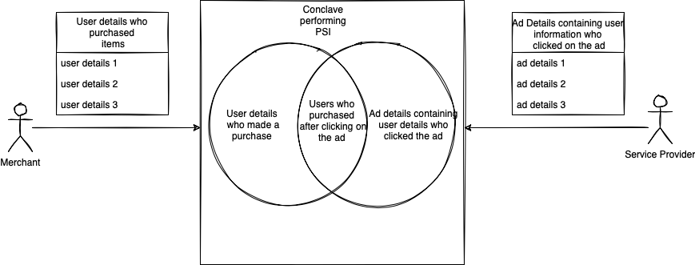

## Conclave Sample: Private Set Intersection

  

Using this sample will see how Conclave (based on Intel SGX) can be a new tool to solve the private set intersection (PSI) problem.

This is a simple app using the Conclave API. It is licensed under the Apache 2 license, and therefore you may 
copy/paste it to act as the basis of your own commercial or open source apps.

Use below link to start download Conclave and start building Conclave apps:

https://conclave.net/get-conclave/

For more information on PSI, kindly take a look at the below blog:

https://medium.com/p/abbd3413567d/edit //TODO change the link once blog is published
        
# What is Private Set Intersection (PSI) problem?

PSI problem refers to the problem of determining the common elements from the intersection of two sets without leaking or disclosing any 
additional information of the remaining elements of the either sets.

# Use case : measuring ad conversion rates

To increase sales, one of the key marketing strategies used these days by merchants, is to publish an ad on the service 
provider (Facebook, Google) platforms.
Depending on the ad conversion rate (users who purchased the items after clicking on the ad), the merchant makes payments
to the service providers.
Measuring ad conversion rates is done usually by comparing the list of people who have seen an ad with those who have 
completed a transaction(purchased a product). 
These lists are held by the advertiser (say, Google or Facebook), and by merchants, respectively. 
It is often possible to identify users on both ends, using identifiers such as credit card numbers, email addresses, etc. 
A simple solution, which ignores privacy completely, is for one side to disclose its list of customers to the other side, 
which then computes the necessary statistics. 

For this use case, the merchant wants to calculate the ad conversion rate. Merchant usually tends to share the list of 
converted user details with the Service Provider.
Service Provider has list of users who has clicked on the ad. Service Provider performs an intersection of these lists 
on its side to check which converted users had clicked the ad.

## Parties involved in the sample
Merchant, Service Provider, Host.

Merchant - a Merchant who has a list of users who have purchased their product.  

Service Provider - Service Provider like Facebook, Google who publishes ads on its website.

Host - Hosts the enclave to calculate ad conversion rate.

For simplicity, in this sample clients pass in following data to enclave:

Merchant - Merchant passes credit card numbers of all users who have made a purchase.

Service Provider - Service Provider passes credit card numbers of all users who have clicked the ad.

## How to run on a non-linux based system

Start the host on a non-Linux system, which will build the enclave and host:

    ./container-gradle host:run

On your terminal, once the host starts, pass in the credit card numbers via Merchant terminal

    ./gradlew client:run --args="MERCHANT <CONSTRAINT> 1123 4456 777998 88988898"

On your terminal, start Service Provider and pass in the credit card numbers of users who have clicked the ad

    ./gradlew client:run --args="SERVICE-PROVIDER <CONSTRAINT> 88988898 77879 00989"

Once both the clients pass in the credit card numbers, the host calculates the ad conversion rate within the enclave and sends it to both the clients.

## How to run on a linux based system

Start the host on a non-Linux system, which will build the enclave and host:

    ./gradlew host:run

On your terminal, once the host starts, pass in the credit card numbers via Merchant terminal

    ./gradlew client:run --args="MERCHANT <CONSTRAINT> 1123 4456 777998 88988898"

On your terminal, start Service Provider and pass in the credit card numbers of users who have clicked the ad

    ./gradlew client:run --args="SERVICE-PROVIDER <CONSTRAINT> 88988898 77879 00989"

Once both the clients pass in the credit card numbers, the host calculates the ad conversion rate within the enclave and sends it to both the clients.

Please note:
The enclave constraint to be passed to the client arguments can be found printed during the build process as below:

    Enclave code hash:   DB2AF8DD327D18965D50932E08BE4CB663436162CB7641269A4E611FC0956C5F`
In this case the hash `DB2AF8DD327D18965D50932E08BE4CB663436162CB7641269A4E611FC0956C5F` is the enclave constraint.

To read more on Conclave go to the documentation site - https://docs.conclave.net