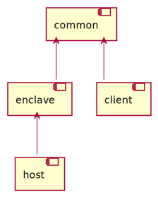
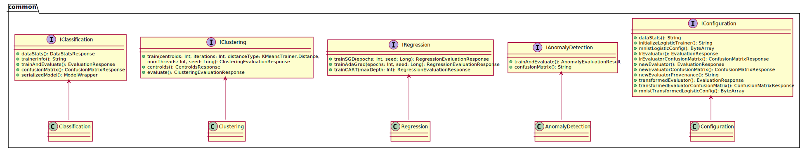
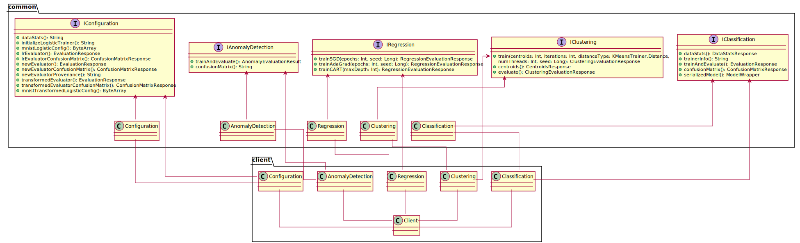
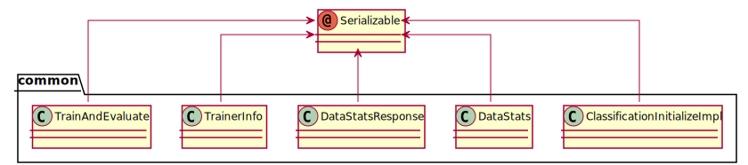
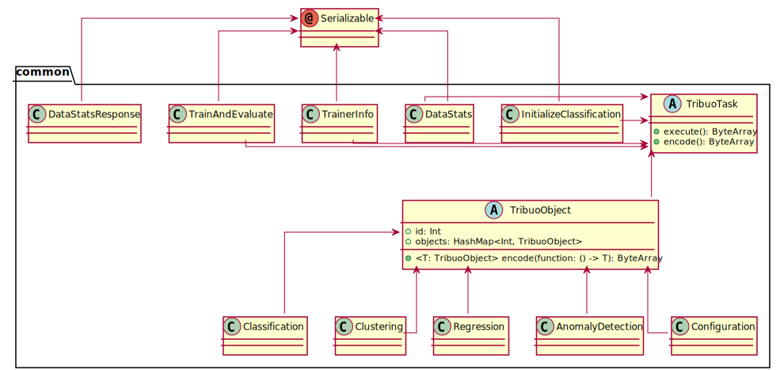
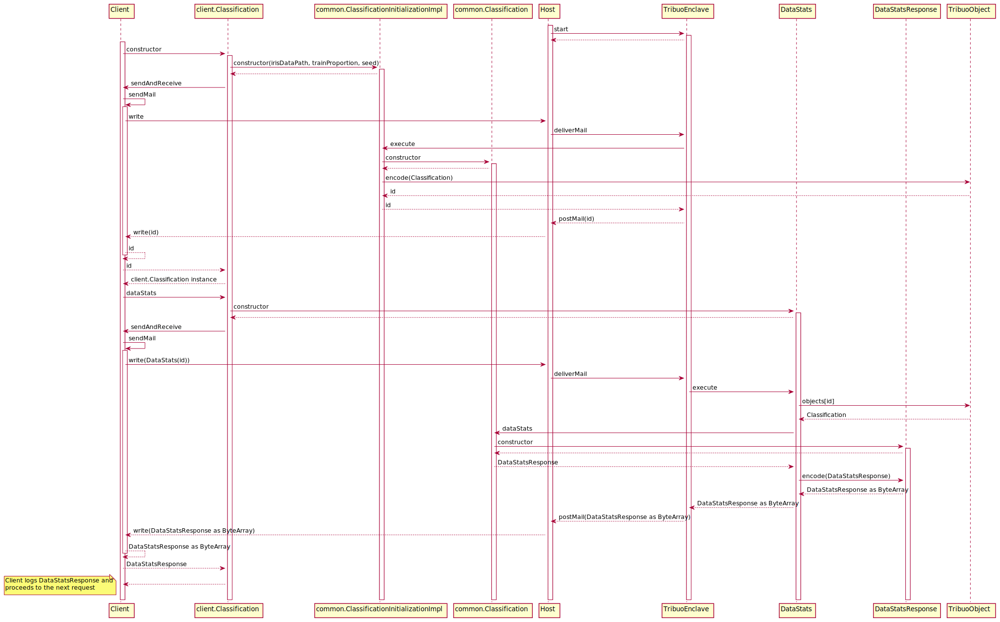

# Tribuo tutorials

[Tribuo](https://tribuo.org) is a Java machine learning library, which makes it well
suited to run with Conclave.
It provides tools for classification, regression, clustering, model development, and more.

If you are new to Conclave, start by reading our [documentation](https://docs.conclave.net) and
[hello world tutorial](https://docs.conclave.net/writing-hello-world.html).

If you are new to Tribuo, follow the [Classification Tutorial](https://tribuo.org/learn/4.0/tutorials/irises-tribuo-v4.html).
It introduces the ins and outs of training and testing a model as well as loading and saving the model for future use.

Take your time to familiarize yourself with the following tutorials as it will make
it easier to understand this project.
* [Classification](https://tribuo.org/learn/4.0/tutorials/irises-tribuo-v4.html)
* [Clustering](https://tribuo.org/learn/4.0/tutorials/clustering-tribuo-v4.html)
* [Regression](https://tribuo.org/learn/4.0/tutorials/regression-tribuo-v4.html)
* [Anomaly Detection](https://tribuo.org/learn/4.0/tutorials/anomaly-tribuo-v4.html)
* [Configuration](https://tribuo.org/learn/4.0/tutorials/configuration-tribuo-v4.html)

The scenarios that these tutorials explore is one where you want to train or utilise a model on a computer operated by
a third party and where it is imperative that the third party cannot access the training data or the resulting models
and that they cannot observe or influence execution. The tutorials demonstrate how to use Conclave to create
secure enclaves that can operate in this manner, and how to access them remotely in a way that can verify that
the models are indeed being executed in a mode that is protected from the owner of the computer on which they run.

To keep the communication between the client and enclave secure, [Mail](https://docs.conclave.net/mail.html)
is being used. Each mail contains a serialized request for the enclave to execute some action, i.e.,
sending configuration parameters for training models and obtaining evaluation results.
[Kotlin's serialization](https://github.com/Kotlin/kotlinx.serialization/tree/v1.0.1/docs) is used to serialize
requests and responses.

## Running
This project is compatible with Conclave v1.1. To run it, execute the following instructions:

* Set the `conclaveRepo` property in `gradle.properties` or override it on the command line,
so it points to your Conclave distribution.

On Linux:
* Run `./gradlew host:run`, which will launch the host and wait for the client to connect.
* Run `./gradlew client:run --args "<productID> <codeSigner> <securityInfoSummary>"`,
which will launch the client, connect to the host and execute all tutorials.

On macOS:
* Run `<path to conclave-sdk>/scripts/container-gradle host:run`
* Run `<path to conclave-sdk>/scripts/container-gradle client:run --args "<productID> <codeSigner> <securityInfoSummary>"`

On Windows:
* Run `gradlew -PenclaveMode=mock host:run`
* Run `gradlew -PenclaveMode=mock client:run --args "<productID> <codeSigner> <securityInfoSummary>"`

When running on a non-secure mode, `--args` can be set to
`"1 4924CA3A9C8241A3C0AA1A24A407AA86401D2B79FA9FF84932DA798A942166D4 INSECURE"`, if
using the provided `sample_private_key.pem`. For `mock` mode, only the `<productID>`
is required, while `<codeSigner>` and `securityInfoSummary` are ignored and set to
`0000000000000000000000000000000000000000000000000000000000000000` and `INSECURE`
respectively in the code.

### Enclave modes
The gradle property `enclaveMode` can be set on the `host` **and**
`client` modules to switch between `mock`, `simulation`, `debug` or
`release` modes.

The `client/data/enclave-config.json`, used in the Configuration
tutorial, contains the paths where the enclave will expect the data
files. The original file contains paths to the root (`/`) of the
enclave's in-memory file system, but when running in `mock` mode
the `client` code will substitute them to the absolute path of the
`client`'s `data` directory, since in `mock` mode the JVM's default
file system is used.
The `client` code will restore the file when the execution is
successful in `mock` mode, however, in case an exception is thrown
the file may not be restored and you may need to revert it manually.
Check the `MockFileManager` class and the
`client.Configuration.configurationFile` property to understand
how the substitutions are being done.

## Structure

This project is composed of the following modules:

* client
* common
* enclave
* host

The `client` module is responsible for connecting to the `host`, send requests to
the `enclave` and log the responses.

The `common` module includes the data classes representing the requests and
responses as well as the logic to process them.

The `enclave` module is responsible for receiving [Mail](https://docs.conclave.net/mail.html),
deserializing the requests coming from the `client`, processing them
and serializing the responses back to the client via [Mail](https://docs.conclave.net/mail.html).

The `host` module is responsible for starting the `enclave` and forwarding
[Mail](https://docs.conclave.net/mail.html) between `client` and `enclave`.




### Client/Enclave communication

The `common` package contains the interfaces and methods used in the
communication between `client` and `enclave`. Each interface and set of methods
represents a tutorial, meaning there is one for Classification, Clustering,
Regression, Anomaly Detection and Configuration.



The `client` package contains a similar set of classes which implement the same
interfaces. The `common` implementations contain the actual machine learning logic
to be executed by the `enclave`, while the `client` implementations simply build
and send requests, receive the responses from the enclave and keep track of relevant
state. This pairing of classes creates a hand-crafted Remote Procedure Call
framework between `client` and `enclave`.



When the `client` invokes `client.Classification.dataStats()`, the `enclave` will
execute `common.Classification.dataStats()` and so on. For that to happen,
the `client` and `enclave` need to share request and response data classes.

These data classes representing the requests and responses are part of the `common`
module. Using `Classification` as an example, there is a set of data classes in
`common/Classification.kt` used for serializing the requests and responses:

* `InitializeClassification`
* `DataStats`
* `DataStatsResponse`
* `TrainerInfo`
* `TrainAndEvaluate`

They are all annotated with `kotlinx.serialization.Serializable` annotation,
delegating to Kotlin the serialization of each classes members. Some classes,
such as `DataStatsResponse`, specify a custom serializer class, which can be found
in the `Serializers.kt` file.



When `client.Classification` is initialized, it will start by initializing the
`irisDataPath` and `id` fields:

```kotlin
/**
     * Send the irises dataset to the enclave so that when [Classification] tutorial
     * is initialized the data is already available.
     */
    val irisDataPath: String = client.sendResource(IRIS_DATA_FILE_NAME)

    /**
     * Sends a message to the enclave requesting the initialization of the
     * [Classification] tutorial.
     * The enclave returns the unique id of the tutorial to use when
     * executing the remote procedure calls.
     */
    private val id: Int = client.sendAndReceive(InitializeClassification(irisDataPath, 0.7, 1L))
```

First, the `client` sends the iris dataset file, storing the file path of the
file as per the enclave's in-memory file system in `irisDataPath`. Secondly,
the `common.InitializeClassification` request is sent, which is used to
create an instance of `common.Classification` in the enclave, which will be
identified by the returned `id`. This creates a 1:1 relationship between
`client` and `enclave` classes, sharing a common interface, where the `client`
classes implementations send requests and cache the necessary returned responses,
while the `enclave` will actually process and execute said requests, by executing
the `common.Classification` logic.

Once `common.Classification` is initialized in the `enclave`, the `client` can use
the `id` to submit further requests, which will be executed on the `enclave`'s
instance. The `enclave` keeps a `HashMap` of `id`s
and instances on `common.TribuoObject.objects` in order to execute the requests on
the right instance.

Aside from the first initialization request, further requests will be composed by
the `id` and any necessary input parameters.

### Serialization
A lot of the `client`/`enclave` communication revolves around serialization, in
particular, [Kotlin's serialization](https://github.com/Kotlin/kotlinx.serialization/tree/v1.0.1/docs). Most of the relevant serialization logic is in the
`TribuoTask.kt` and `Serializers.kt` files, as well as in each
categories' files and classes, for example, `common/Classification.kt`, where
`common.Classification` and its related requests and responses are, such as,
`common.DataStats` and `common.DataStatsResponse`.



When the `client` sends a request, it uses the `Client.sendAndReceive` function.
```kotlin
/**
     * Serialize and send a request to the enclave and deserialize the response.
     * @param task the request to the enclave.
     * @return the deserialized response from the enclave.
     */
    inline fun <reified R> sendAndReceive(task: TribuoTask): R {
        sendMail(task.encode())
        return decode(receiveMail().bodyAsBytes)
    }
```

This function invokes the `TribuoTask.encode()` function, responsible for serializing
the task into a `ByteArray`. The function then sends a [Mail](https://docs.conclave.net/mail.html) message, which will be processed by the enclave, waits until
receiving a [Mail](https://docs.conclave.net/mail.html) with the response, which will
be serialized, and invokes the `decode` function in `TribuoTask.kt` in order
to deserialize the response to the correct type.

When the `enclave` receives a [Mail](https://docs.conclave.net/mail.html) message, it
deserializes the body as a `TribuoTask` which uses [Kotlin's Polymorphic Serialization](https://github.com/Kotlin/kotlinx.serialization/blob/v1.0.1/docs/polymorphism.md) to instantiate the correct request type. Once the task is obtained,
it is executed via the `TribuoTask.execute()` function which returns a `ByteArray`
with the serialized response which will be sent via
[Mail](https://docs.conclave.net/mail.html) back to the `client`.

```kotlin
    /**
     * Deserialize the request sent by the client, execute it and mail the serialized result.
     * @param id An opaque identifier for the mail.
     * @param mail Access to the decrypted/authenticated mail body+envelope.
     * @param routingHint ignored
     */
    override fun receiveMail(id: Long, mail: EnclaveMail, routingHint: String?) {
        val data = String(mail.bodyAsBytes)
        val task = format.decodeFromString(TribuoTask.serializer(), data)
        sendMail(mail, task.execute())
    }
```

The `messageModule` on `TribuoTask.kt` defines all `TribuoTask` subclasses
to be used on polymorphic deserialization as well as some contextual serializers for
some Tribuo types. Some of the Tribuo types are `java.io.Serializable` and the
contextual serializers leverage that by invoking
`inline fun <reified T> deserializeJavaObject(decoder: Decoder): T` and
`inline fun <reified T> serializeJavaObject(encoder: Encoder, value: T)` to
serialize and deserialize those types.


```kotlin
/**
 * Deserializes a single [java.io.Serializable] to an instance of type [T].
 */
inline fun <reified T> deserializeJavaObject(decoder: Decoder): T {
    val byteArray = decoder.decodeSerializableValue(ByteArraySerializer())
    ByteArrayInputStream(byteArray).use { bis ->
        ObjectInputStream(bis).use { ois ->
            return ois.readObject() as T
        }
    }
}

/**
 * Serializes a single [java.io.Serializable] instance of type [T].
 */
inline fun <reified T> serializeJavaObject(encoder: Encoder, value: T) {
    val byteArrayOutputStream = ByteArrayOutputStream()
    byteArrayOutputStream.use { outputStream ->
        ObjectOutputStream(outputStream).use { oos ->
            oos.writeObject(value)
        }
    }
    encoder.encodeSerializableValue(ByteArraySerializer(), byteArrayOutputStream.toByteArray())
}
```

### Requests and responses
When initialization requests are executed by the `enclave`, for example the
`InitializeClassification` request, which creates an instance of
`common.Classification`, their `execute()` implementation will invoke
`TribuoObject.encode()`, which takes the `TribuoObject`'s initialization
function and returns the instance's `id`, serialized as a `ByteArray`.

`TribuoObject.encode` creates the instance by invoking the `function`, stores it
in `objects` and returns the task's `execute()` result, which will be the serialized
`id`. This pattern is followed by all initialization requests.

```kotlin
@Serializable
data class InitializeClassification(val irisDataPath: String, val trainProportion: Double, val seed: Long) : TribuoTask() {
    /**
     * Initializes a [Classification] instance in the enclave.
     * @return The unique id of the [Classification] instance.
     */
    override fun execute(): ByteArray {
        return encode {
            Classification(id.getAndIncrement(), irisDataPath, trainProportion, seed)
        }
    }
}

abstract class TribuoObject(val id: Int) : TribuoTask() {
    companion object {
        /**
         * Initializes the [TribuoObject] and adds it to [objects].
         * @param function The [TribuoObject]'s initialization function.
         * @return The unique [id] of the [TribuoObject] instance.
         */
        @Synchronized
        fun <T: TribuoObject> encode(function: () -> T): ByteArray {
            val t = function()
            objects[t.id] = t
            return t.execute()
        }
    }
```

For the other requests, for example `common.DataStats`,
their `execute()` function will invoke
`inline fun <T, reified R> encode(id: Int, function: (T) -> R): ByteArray`,
in `TribuoTask.kt`, which takes an instance's `id` and the `function` to execute
on the instance.

```kotlin
/**
 * Request for obtaining the training and testing dataset statistics.
 * @param id The [Classification] instance id on which to execute the request.
 */
@Serializable
class DataStats(private val id: Int) : TribuoTask() {
    /**
     * Obtains the training and testing dataset statistics from the
     * requested instance.
     * @return The serialized statistics.
     */
    override fun execute(): ByteArray {
        return encode(id) { classification: Classification ->
            classification.dataStats()
        }
    }
}

/**
 * Obtains the [TribuoObject] instance from [TribuoObject.objects] on which to
 * execute the [function].
 * @param id The id of the [TribuoObject]'s instance to obtain.
 * @param function The function to be executed on the [TribuoObject]'s instance.
 * @return The serialized [function]'s return value serialized to a [ByteArray].
 */
inline fun <T, reified R> encode(id: Int, function: (T) -> R): ByteArray {
    @Suppress("UNCHECKED_CAST") val obj = TribuoObject.objects[id] as T
    return Json.encodeToString(function(obj)).toByteArray()
}
```

The `encode` function will encode the returned value from `function`,
serialize it as a `ByteArray` and the `enclave` will send the response to
the client.

When the responses arrive at the `client` they are deserialized by the
`inline fun <reified R> decode(encoded: ByteArray): R` function, in
`TribuoTask.kt`, which will deduce the correct type from the calling
interface method shared by both `client` and `common` implementations,
ensuring the correct type is used between `client` and `enclave`.

```kotlin
/**
 * Deserializes a response to an instance of its expected type [R].
 * @param encoded Serialized response as a [ByteArray].
 * @return Instance of the response type.
 */
inline fun <reified R> decode(encoded: ByteArray): R {
    return format.decodeFromString(String(encoded))
}
```

### Sequence diagram
Using `Classification` and `DataStats` as an example, the following sequence
diagram illustrates the message exchange between `client` and `enclave`,
a common pattern for all the requests.
Encoding and decoding on the client side have been omitted.



## Serialization and Reflection configuration
Tribuo uses Java Serialization and Reflection, which requires configuration in order
to work with Conclave.

To know more about how to configure them, check our documentation on
[reflection configuration files](https://docs.conclave.net/enclave-configuration.html#reflectionconfigurationfiles)
and [serialization configuration files](https://docs.conclave.net/enclave-configuration.html#serializationconfigurationfiles).

The files used on this project can be found in `enclave/serialization-config.json`
and `enclave/reflect-config.json`.

## Limitations
It is currently not possible to work with [external models](https://tribuo.org/learn/4.0/tutorials/external-models-tribuo-v4.html)
in Conclave.

## Acknowledgments
The tutorials use the [Iris](https://archive.ics.uci.edu/ml/datasets/Iris) and
[Wine](https://archive.ics.uci.edu/ml/datasets/Wine) datasets, from
[UCI Machine Learning Repository](https://archive.ics.uci.edu/ml/index.php) and also the
[The MNIST database of handwritten digits](http://yann.lecun.com/exdb/mnist/).

The data files have been obtained from:
* [bezdekIris.data](https://archive.ics.uci.edu/ml/machine-learning-databases/iris/bezdekIris.data)
* [winequality-red.csv](https://archive.ics.uci.edu/ml/machine-learning-databases/wine-quality/winequality-red.csv)
* [train-images-idx3-ubyte.gz](http://yann.lecun.com/exdb/mnist/train-images-idx3-ubyte.gz)
* [train-labels-idx1-ubyte.gz](http://yann.lecun.com/exdb/mnist/train-labels-idx1-ubyte.gz)
* [t10k-images-idx3-ubyte.gz](http://yann.lecun.com/exdb/mnist/t10k-images-idx3-ubyte.gz)
* [t10k-labels-idx1-ubyte.gz](http://yann.lecun.com/exdb/mnist/t10k-labels-idx1-ubyte.gz)

> Please refrain from accessing the [The MNIST database of handwritten digits](http://yann.lecun.com/exdb/mnist/) files
from automated scripts with high frequency. Make copies!
